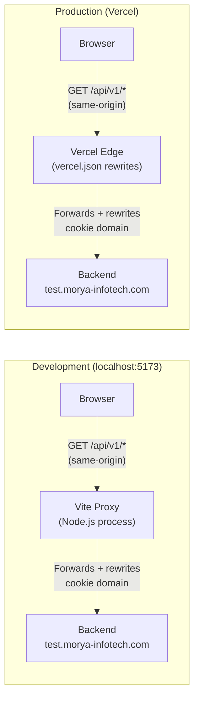

# Auth Architecture — Cross-Origin Cookie Problem

## Why the Problem Exists

The browser enforces **SameSite cookie policy**. When the backend sets an HttpOnly cookie, the browser scopes it to the server's domain (`test.morya-infotech.com`). Any request from a **different origin** (`localhost:5173` in dev, `your-app.vercel.app` in prod) will have the cookie silently dropped — regardless of `credentials: 'include'`.

```
Frontend origin:  https://your-app.vercel.app
Backend origin:   https://test.morya-infotech.com
                  └── Different domain → browser blocks cookie ❌
```

---

## Is the Vite Proxy Correct and Secure?

**For development: Yes. Correct and the right approach.**  
**For production: No. It does not exist.**

When you run `vite build`, Vite produces static files. There is no running Vite process, no proxy, no server. The `server.proxy` config in `vite.config.ts` is a **dev-only feature** — it has zero effect on the built output deployed to Vercel.

> [!CAUTION]
> Never rely on Vite proxy as a production architecture. It is a development convenience only.

---

## Solution Options — Ranked by Recommendation

### ✅ Option 1: Reverse Proxy at the Hosting Layer (Recommended)

**The idea:** The frontend and "API" are always the same origin from the browser's perspective. A proxy at the hosting edge layer (Vite in dev, Vercel rewrites in prod, Nginx/Caddy elsewhere) forwards `/api/*` requests to the real backend server-side.

```
Browser ──────────────────────────────────────────────────────────
  │  GET /api/v1/auth/refresh       (same-origin: no CORS, cookie sent ✅)
  │
  ▼
Vercel Edge / Vite Dev Server / Nginx
  │  Forwards transparently to https://test.morya-infotech.com
  │  Rewrites cookie domain on Set-Cookie responses
  │
  ▼
Backend https://test.morya-infotech.com
```

| Layer | Tool | Config |
|-------|------|--------|
| Development | Vite `server.proxy` | `vite.config.ts` ✅ already done |
| Vercel Production | `vercel.json` rewrites | `vercel.json` (see below) |
| Nginx / Caddy / Any VPS | `proxy_pass` directive | Infra config |
| AWS CloudFront | Behavior rules | CDN config |
| Other CDN | Platform-specific | Platform config |

**Key insight:** The frontend code **never changes**. `VITE_API_URL=/api/v1/` always. The hosting platform decides where `/api/*` goes. This is the **platform-agnostic, scalable** approach.

**Security:** ✅ Excellent. HttpOnly cookies remain HttpOnly. SameSite=Strict works. No token ever touches JavaScript. No CORS wildcard.

---

### ✅ Option 2: Custom Subdomain (Best Long-Term)

Move both to the same parent domain:

```
Frontend:  https://app.morya-infotech.com      (Vercel custom domain)
Backend:   https://api.morya-infotech.com      (existing backend)
```

Backend sets cookie with `Domain=.morya-infotech.com`. The browser sends it to **all subdomains** of `morya-infotech.com` — including `app.morya-infotech.com`. No proxy needed. SameSite=Lax works correctly.

**Requires:**
- Custom domain on Vercel (free, takes 5 minutes with DNS)
- Backend to change cookie `Domain` to `.morya-infotech.com`

**Security:** ✅ Best. True same-site. No proxy needed. Cookies are SameSite=Lax by default.

---

### ⚠️ Option 3: Backend Sets `SameSite=None; Secure` (Least Recommended)

Backend changes its cookie attributes to `SameSite=None; Secure` and configures CORS:
```
Access-Control-Allow-Origin: https://your-app.vercel.app
Access-Control-Allow-Credentials: true
```

**Requires:** Backend changes (not always possible).  
**Security:** ⚠️ Weaker. `SameSite=None` allows the cookie on all cross-site requests (including third-party embeds). Requires maintaining an explicit allowlist of allowed origins on the backend.

---

## What Happens on Different Hosting Platforms

| Platform | Solution |
|----------|----------|
| **Vercel** | `vercel.json` rewrites → same relative URL, zero code changes |
| **Netlify** | `netlify.toml` redirects with `force = true` |
| **AWS S3 + CloudFront** | CloudFront Behavior rule proxying `/api/*` |
| **Nginx (VPS/Docker)** | `proxy_pass` block for `/api/` location |
| **Caddy** | `reverse_proxy /api/* backend:port` |
| **Any other** | Same pattern: proxy `/api/*` at the server/CDN layer |

In every case: **the frontend code is identical**. `VITE_API_URL=/api/v1/`. The hosting layer handles routing.

---

## Recommended Architecture (Production)



---

## Implementation

### `vercel.json` (create at project root or apps/web/)

```json
{
  "rewrites": [
    {
      "source": "/api/:path*",
      "destination": "https://test.morya-infotech.com/api/:path*"
    }
  ]
}
```

> [!NOTE]
> Vercel rewrites are processed at the edge before static file serving. If `/api/*` matches a static file path (it won't), rewrites take priority. This is zero-latency proxy — it's handled by Vercel's global edge network, not a cold-start function.

### `.env.local` (dev — already done)
```
VITE_API_URL=/api/v1/
```

### Production environment on Vercel
Set `VITE_API_URL=/api/v1/` in Vercel's Environment Variables dashboard.  
The rewrite handles routing. The value is the same as dev.

---

## Security Checklist for This Architecture

| Concern | Status | Notes |
|---------|--------|-------|
| HttpOnly refresh token | ✅ | Never accessible from JavaScript |
| CSRF protection | ⚠️ | Backend should validate `Origin` / `Referer` headers |
| Token exposure | ✅ | Access token in short-lived JS cookie, refresh token HttpOnly |
| XSS → token theft | ✅ | Refresh token unreachable. Access token short-lived |
| Cookie interception | ✅ | HTTPS everywhere in production |
| Wildcard CORS | ✅ | No CORS needed at all with proxy approach |
| SameSite policy | ✅ | Same-origin from browser's view → Strict works |

> [!IMPORTANT]
> One remaining backend ask: ensure the backend does **not** hard-code `Domain=test.morya-infotech.com` in the Set-Cookie response. If it does, Vercel's rewrite passes the header through and the browser rejects the cookie (wrong domain). The backend should either omit `Domain` entirely (cookie scopes to the requesting origin) or set it dynamically based on the `Origin` request header.


# Should you remove "server" confgig from vite.config.ts?


**No, you should keep the `server` configuration in `vite.config.ts`.** 

Here is why:

1. **`vite.config.ts` is only for Local Development:** The `server: { proxy: ... }` block only runs when you start your app locally on your laptop (`localhost:5173`). Because your laptop will always be a different origin from the API (`test.morya-infotech.com`), you will always need this proxy to rewrite the cookies so you can log in while writing code. 
2. **It is Ignored in Production:** When you build your app for deployment (`vite build`), Vite completely ignores the `server` block. It has absolutely zero effect on your deployed application.

### What you *can* remove if you move to the same origin:

If you deploy your UI to a subdomain (e.g., `app.morya-infotech.com`) while your API is on `api.morya-infotech.com` or `test.morya-infotech.com`:

* You can remove the proxy rewrites from your **`vercel.json`** (or Nginx config).
* You would change your production `.env` to point directly to the full API URL (`VITE_API_URL=https://test.morya-infotech.com/api/v1/`).

As long as the backend sets the cookie with `Domain=.morya-infotech.com`, the browser will natively share the cookie between the UI and API in production without any proxies needed!